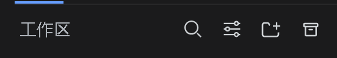
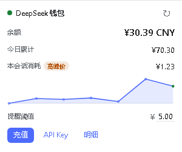

# dsh-chrome-suite

[中文](README.md) | English

Window chrome: restart button, session archive button, wallet

## Packages

| Directory | What it does |
|---|---|
| `dsh-restart-button` | Two-click Restart DSH in the session header, restarts exactly this instance |
| `dsh-archive-button` | Two-click archive: zips sessions idle for more than 3 days, deletes the originals |
| `dsh-wallet` | Balance, per-session cost, peak/off-peak pricing, one-click recharge |

## Release lines

| Release | DSH line | Notes |
|---|---|---|
| `v0.1.2` | 0.1.7 | Features developed on the local DSH 0.1.7 line; this update |
| `v0.1.0` | 0.1.6 | Last release of the DSH 0.1.6 line; stays usable, no further updates |

## Install

```sh
# one package
dsh plugin --profile web add file:<this repo>/dsh-restart-button
```

Or install the whole family on Windows PowerShell:

```powershell
./install.ps1
```

Install straight from the release, no clone needed:

```sh
dsh plugin --profile web add "https://github.com/Ln1m/dsh-chrome-suite/releases/download/v0.1.2/dsh-head-restart-0.1.2.tgz"
dsh plugin --profile web add "https://github.com/Ln1m/dsh-chrome-suite/releases/download/v0.1.2/dsh-archive-button-0.1.2.tgz"
dsh plugin --profile web add "https://github.com/Ln1m/dsh-chrome-suite/releases/download/v0.1.2/dsh-wallet-1.3.3.tgz"
```

If the install fails with `UNABLE_TO_VERIFY_LEAF_SIGNATURE` (a TLS-intercepting proxy; Node does not read the system CA store by default), run `$env:NODE_OPTIONS='--use-system-ca'` first.

Restart the web instance afterwards. Each package directory carries its own README.

## Screenshots






## License

MIT
